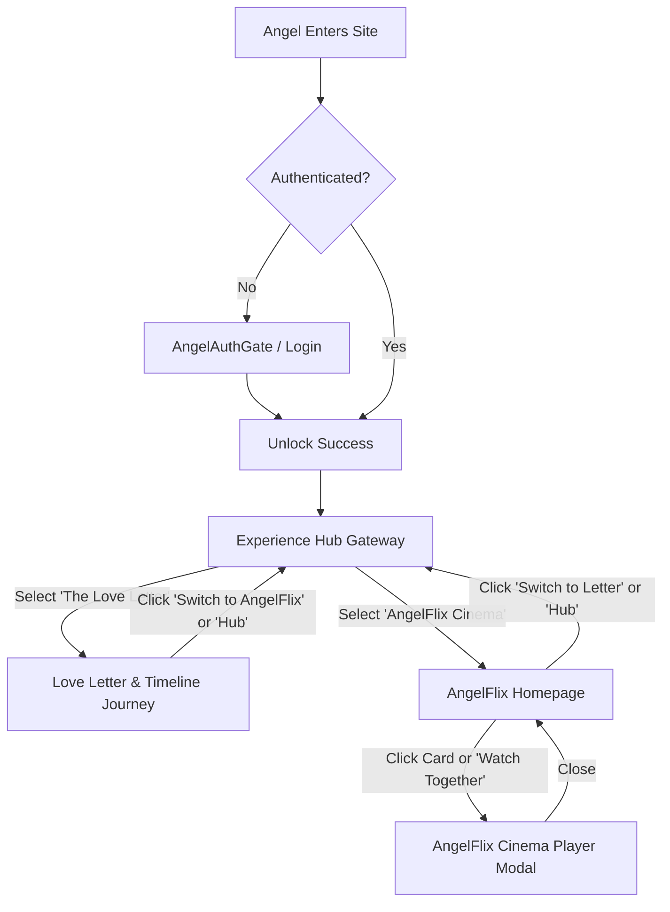

# AngelFlix Integration & Home Experience Gateway Design Specification

**Date:** 2026-08-21  
**Status:** Approved  
**Author:** Antigravity  

---

## 1. Overview & Objective
Integrate the **AngelFlix** Netflix-styled private cinema experience into the existing `monthsarry` website, providing a romantic Home Experience Hub where Angel can choose between:
1. 💌 **The Monthsary Love Letter**: The interactive romantic journey featuring the letter, timeline, photo memories, reaction response form, and live vouchers.
2. 🎬 **AngelFlix: Our Private Cinema**: A dark, Netflix-themed streaming interface showcasing memories, categorized rails (*Recent Memories*, *Chapters of Us*, *Our Favorites*), and an interactive cinematic media player modal.

---

## 2. User Flow & Navigation Architecture

### Route & State Handling
- `viewMode`: `"hub" | "letter" | "angelflix"`
- URL parameter / routing synchronization (`/`, `?view=hub`, `?view=letter`, `?view=angelflix`) so direct navigation is preserved without disrupting existing routes (`/admin/*`).
- Shared background audio player state with toggle and track selector.
- Real-time voucher listener remains active across all views.

---

## 3. Component Breakdown

### 3.1 `ExperienceHub.tsx` (Gateway Hub)
- Netflix-inspired "Choose Your Adventure" screen with dark romantic aesthetic.
- **Card 1 (💌 The Monthsary Letter)**:
  - Romantic rose glass card with pulsing heart, relationship timer summary, and active voucher count pill.
- **Card 2 (🎬 AngelFlix Private Cinema)**:
  - Dark crimson glass card with glowing border, cinema reel icon, and subtitle *"A Love Worth Remembering"*.
- Top bar with logout button and music controller.

### 3.2 `AngelFlix.tsx` (Netflix Streaming Homepage)
- **Top Navigation Bar**:
  - Logo: `ANGELFLIX | Our Private Cinema` in bold modern Netflix font with rose accent.
  - Links: `Our Videos`, `Memories`, `Favorites`, `💌 Love Letter`, `🏠 Home Hub`.
  - Actions: Romantic Easter egg heart button, Profile avatar dropdown.
- **Hero Billboard**:
  - Romantic candlelit couple backdrop with dark gradient fade.
  - Badges: `Romance | Memories | Adventures`.
  - Title: `A Love Worth Remembering`.
  - Sub-meta: `Since 2024 · Every moment matters · Forever yours`.
  - Description: *"A collection of our most precious moments together - first dates, monthsary highlights, trips, laughter, and quiet nights."*
  - CTA Buttons:
    - `Watch Together` (Pink/Crimson button with Play icon) -> opens cinema player.
    - `Our Favorites` (Frosted dark button) -> filters or scrolls to favorites.
    - `Made with love` (Frosted button with Heart icon) -> shows celebratory love popup.
- **Content Rows & Carousels**:
  - **Recent Memories Row**: Horizontal carousel with `<` and `>` arrow navigation for:
    - *First Date* — "A quiet night that changed everything"
    - *Monthsary Highlights* — "Little moments that add up"
    - *Travel Adventures* — "Exploring together"
    - *Funny Moments* — "Laughter is the best memory"
    - *Sweet Messages* — "Words that stay forever"
    - *Our Favorites* — "The ones we replay most"
  - **Chapters of Us Row**: Months 1 through 7 episodes linking directly to each month's photos and story letters.
  - Netflix-style hover scale animations, smooth touch scrolling, and responsive card sizing.

### 3.3 `AngelFlixPlayerModal.tsx` (Interactive Cinema Modal)
- Fullscreen immersive dark backdrop.
- Cinematic photo slideshow with Ken Burns smooth zooming / video playback support.
- Title, category tags, episode counter, and sweet romantic caption.
- Controls: Play/Pause, Next/Previous memory, Auto-slideshow timer, Music toggle, Favorite heart toggle, and Close button.
- Keyboard shortcuts (`ArrowLeft`, `ArrowRight`, `Space`, `Escape`).

### 3.4 `src/config/angelflixConfig.ts`
- Data structure containing:
  - Hero billboard metadata and assets.
  - Memory rails with titles, captions, thumbnails, high-res photos, tags, and stories.
  - Category listings (*Recent Memories*, *Chapters of Us*, *Our Favorites*, *Videos*).

---

## 4. Verification & Testing Strategy
1. Verify authentication gate transitions directly to the Hub Gateway upon login.
2. Verify clicking "The Love Letter" enters the full multi-step letter experience and retains step state.
3. Verify clicking "AngelFlix" loads the Netflix UI with hero banner, category carousels, and functional cards.
4. Verify clicking "Watch Together" and memory cards opens the interactive cinema player with slideshow controls.
5. Verify header switchers and "Back to Hub" buttons work from both experiences.
6. Verify responsive layout on mobile, tablet, and desktop viewports.
7. Run all automated unit and component tests (`vitest` / `npm test`).
